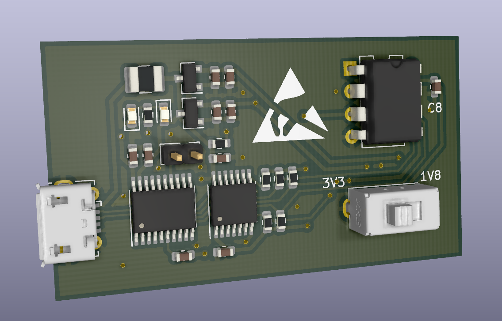

# ch552-serprog

# 简介

使用ch552设计的兼容[flashrom](https://flashrom.org) serprog协议的SPI nor flash烧录器，支持3.3V和1.8V电压。



# 固件

本仓库仅包含原理图及PCB文件，程序在[这个仓库](https://github.com/ieiao/ch554_sdcc)的`serprog`分支`examples/serprog`目录下。

# 使用方法

```shell
$ # 读flash
$ flashrom -p serprog:dev=/dev/ttyACM0:4000000 -r /tmp/read.bin
$ # 擦除flash
$ flashrom -p serprog:dev=/dev/ttyACM0:4000000 -E
$ # 写flash
$ flashrom -p serprog:dev=/dev/ttyACM0:4000000 -w /tmp/read.bin
```

受ch552性能以及程序实现影响，flash读写速度未能达到上限，以下是使用SST25VF032B 32Mbit(4Mbyte) flash测出的读写平均耗时

| 操作 | 耗时 |
| :--: | :--: |
| 全片读 | 10s |
| 全片擦除 | 30s |
| 全片读+写+校验 | 32s |

# 备注

* 原理图中的led灯需要二选一焊接，不可全部焊接
* 如果使用TXS0104，flash测上拉电阻可以不焊接
